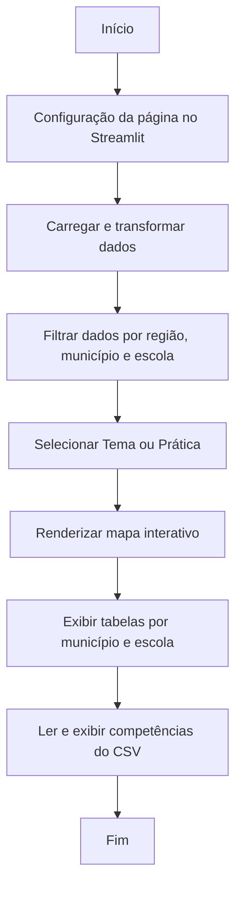

## Bem-vindo à documentação do projeto "Mapeamento das Atividades do Programa Saúde na Escola (PSE)"

```mermaid
graph TD
    A[Início] --> B[Configuração da página no Streamlit]
    B --> C[Carregar e transformar dados]
    C --> D[Filtrar dados por região, município e escola]
    D --> E[Selecionar Tema ou Prática]
    E --> F[Renderizar mapa interativo]
    F --> G[Exibir tabelas por município e escola]
    G --> H[Ler e exibir competências do CSV]
    H --> I[Fim]
```

